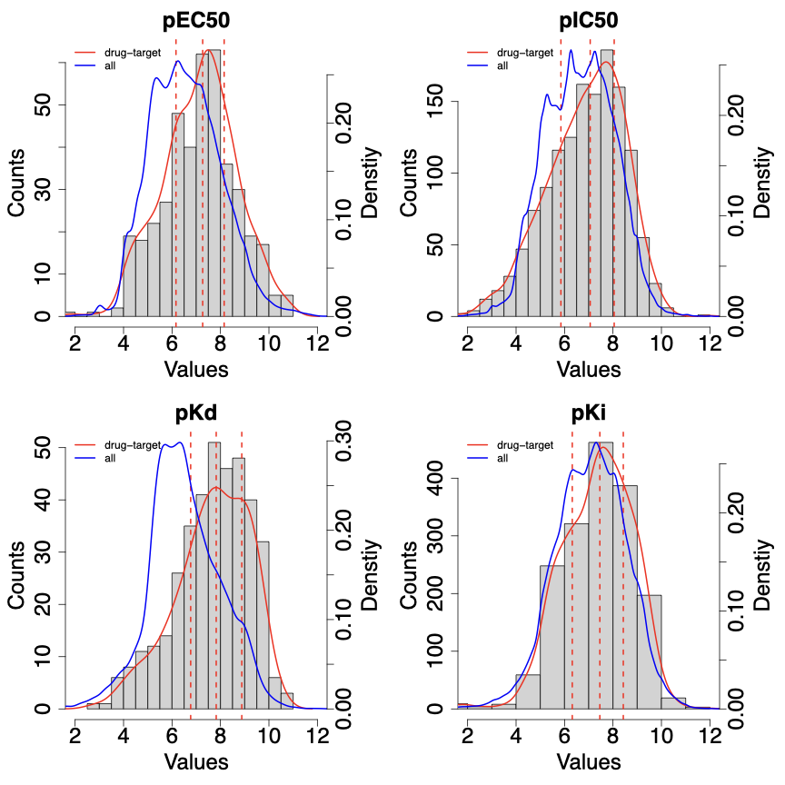

# This repository collects and processes structure data of chemical compounds.  

Detailed documentation about the source dataset can be found [here](downloads/README.md). Detailed documentation about the code can be found [here](src/README.md). Detailed documentation about the generated dataset can be found [here](data/README.md). Below are some brief descriptions of the generated datasets.

## Chemical fingerprints & molecular descriptors: quantifying the structure of chemicals

We computed chemical fingerprints and molecular descriptors for 2,240 compounds from OFFSIDES, and 778,046 compounds from BindingDB. Below are some basic summary statistics of the generated datasets.

| Group of structure features | Feature type | Number of features |
| :------------- | :------------- | :------------- |
| fingerprints | circular | 1,024 |
| fingerprints | estate | 79 |
| fingerprints | extended | 1,024 |
| fingerprints | graph | 1,024 |
| fingerprints | hybridization | 1,024 |
| fingerprints | kr | 4,860 |
| fingerprints | maccs | 166 |
| fingerprints | pubchem | 881 |
| fingerprints | shortestpath | 1,024 |
| fingerprints | standard | 1,024 |
| descriptors | constitutional | 16 |  
| descriptors | electronic | 35 |
| descriptors | geometrical | 49 |
| descriptors | hybrid | 19 |
| descriptors | topological | 160 |
| descriptors | all combined | 279 |

## Compound-target relationships: dichotomizing binding affinity values 

We processed compound-target relationships from BindingDB. We analyzed the distributions of binding affinity values among all known drug-target pairs from DrugBank (shown as red curves in the figure below), as compared to the distributions of binding affinity values among all compound-target pairs (shown as blue curves). We also labeled the first, second, and third quantiles of binding affinity values among all known drug-target pairs (shown as red dashed lines).

We used the first quantile as the threshold for dichotomizing binding affinity values and generating datasets of compound-target relationships. Below are some basic summary statistics of the generated datasets. 

| Type of binding affinity measurement | Type of relationships | Number of relationships |
| :------------- | :------------- | :------------- |
| pEC50 | positive | 44,771 |
| pEC50 | negative | 32,030 |
| pEC50 | all combined | 76,801 |
| pIC50 | positive | 365,419 |
| pIC50 | negative | 166,176 |
| pIC50 | all combined | 531,595 |
| pKd | positive | 7,909 |
| pKd | negative | 11,767 |
| pKd | all combined | 19,676 |
| pKi | positive | 139,521 |
| pKi | negative | 61,564 |
| pKi | all combined | 201,085 |

## References

+ Tatonetti NP, Patrick PY, Daneshjou R, Altman RB. Data-driven prediction of drug effects and interactions. Science translational medicine. 2012 Mar 14;4(125):125ra31-.

+ Mendez D, Gaulton A, Bento AP, Chambers J, De Veij M, Félix E, Magariños MP, Mosquera JF, Mutowo P, Nowotka M, Gordillo-Marañón M. ChEMBL: towards direct deposition of bioassay data. Nucleic acids research. 2019 Jan 8;47(D1):D930-40. 

+ Gilson MK, Liu T, Baitaluk M, Nicola G, Hwang L, Chong J. BindingDB in 2015: a public database for medicinal chemistry, computational chemistry and systems pharmacology. Nucleic acids research. 2016 Jan 4;44(D1):D1045-53.

+ Wishart DS, Feunang YD, Guo AC, Lo EJ, Marcu A, Grant JR, Sajed T, Johnson D, Li C, Sayeeda Z, Assempour N. DrugBank 5.0: a major update to the DrugBank database for 2018. Nucleic acids research. 2018 Jan 4;46(D1):D1074-82.
